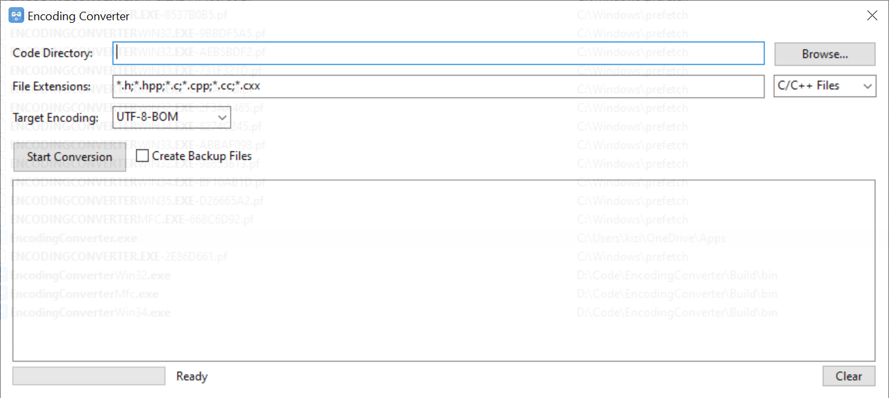

# File Encoding Converter (MFC Edition)

A powerful native Windows application for batch converting file encodings in specified directories. This MFC-based tool provides an intuitive graphical interface for detecting and converting file encodings with native Windows look and feel.

## Features

- **Batch Processing**: Convert multiple files in specified directories at once
- **Multiple Encoding Support**: Support for UTF-8, UTF-8-BOM, GBK, GB2312, UTF-16, UTF-32, ASCII
- **Automatic Encoding Detection**: Uses uchardet library to detect source file encodings
- **Backup Support**: Optional backup of original files before conversion
- **Native Windows Interface**: MFC-based GUI with familiar Windows controls and behavior
- **Real-time Progress**: Live progress tracking and detailed conversion logs
- **Thread-safe Operation**: Background processing with stop functionality
- **Preset File Types**: Quick selection for common file types (C/C++, Web, Text)

## Build Requirements

- CMake 3.21 or higher
- Visual Studio 2019 or later with MFC support
- Windows SDK 10.0 or later
- C++17 compatible compiler
- uchardet library
- iconv library

## Building

### Prerequisites

```bash
# Install vcpkg package manager
git clone https://github.com/microsoft/vcpkg.git
cd vcpkg
./bootstrap-vcpkg.bat
./vcpkg integrate install

# Install dependencies
./vcpkg install uchardet:x64-windows iconv:x64-windows
```

### Build Steps

```bash
# Clone the repository
git clone https://github.com/kkzi/EncodingConverter
cd EncodingConverter

# Create build directory
mkdir build && cd build

# Configure with CMake
cmake .. -DCMAKE_TOOLCHAIN_FILE=/path/to/vcpkg/scripts/buildsystems/vcpkg.cmake -DVCPKG_TARGET_TRIPLET=x64-windows-static-md

# Build
cmake --build . --config Release
```

## Download Precompiled Version

If you prefer not to build from source, you can download the precompiled version directly:

- **Latest Release**: [https://github.com/kkzi/EncodingConverter/releases/tag/latest](https://github.com/kkzi/EncodingConverter/releases/tag/latest)

Simply download the executable and run it on your Windows system.

## Usage

### Application Interface



### MFC GUI Application

The MFC GUI application provides a native Windows interface for file encoding conversion:

1. Run the executable:
   ```bash
   ./Build/bin/EncodingConverterMfc.exe
   ```

2. **Select Directory**: Click "Browse..." to select a directory containing files to convert
3. **File Types**: Choose from preset file types (C/C++, Web, Text) or specify custom extensions
4. **Target Encoding**: Select from the dropdown menu (UTF-8, UTF-8-BOM, GBK)
5. **Backup Options**: Check "Create Backup" to backup original files
6. **Start Conversion**: Click "Start Conversion" to begin
7. **Monitor Progress**: View real-time progress and conversion results in the log window
8. **Stop Conversion**: Click "Stop" to halt the conversion process at any time

**Key Features:**
- Native Windows look and feel with standard controls
- Real-time progress bar showing conversion percentage
- Detailed conversion log with color-coded results:
  - Green: Successful conversion
  - Orange: Warning or skipped files
  - Red: Failed conversions
- Thread-safe operation with stop functionality
- Preset file type selections for convenience
- Semi-transparent window with modern appearance

### CLI Version

The CLI version is suitable for automation and scripting:

```bash
./cli/encoding_converter --dirs "/path/to/dir1,/path/to/dir2" --exts ".h,.cpp,.c" --target "UTF-8"
```

#### Command Line Options

- `-d, --dirs`: Comma-separated list of directories to process
- `-e, --exts`: Comma-separated list of file extensions to convert
- `-t, --target`: Target encoding for conversion (e.g., UTF-8)
- `-h, --help`: Print usage information

#### Examples

```bash
# Convert C++ files to UTF-8
./cli/encoding_converter --dirs "/home/user/project" --exts ".h,.cpp,.c" --target "UTF-8"

# Convert text files with backup
./cli/encoding_converter --dirs "/home/user/docs" --exts ".txt,.md" --target "UTF-8-BOM"

# Multiple directories
./cli/encoding_converter --dirs "/src,/include" --exts ".h,.hpp" --target "GBK"
```

## Supported Encodings

The application supports conversion between the following encodings:

- **UTF-8**: Standard UTF-8 encoding
- **UTF-8-BOM**: UTF-8 with BOM (Byte Order Mark)
- **GBK**: Simplified Chinese encoding
- **GB2312**: Legacy Simplified Chinese encoding
- **UTF-16**: 16-bit Unicode encoding
- **UTF-32**: 32-bit Unicode encoding
- **ASCII**: Standard ASCII encoding

## Project Structure

```
EncodingConverter/
├── EncodingConverterMfc/   # MFC GUI version
│   ├── MainDialog.h        # Main dialog class
│   ├── MainDialog.cpp      # Main dialog implementation
│   ├── CustomRichEdit.h    # Custom rich edit control
│   ├── CustomRichEdit.cpp  # Custom rich edit implementation
│   ├── resource.h          # Resource identifiers
│   ├── Dialog.rc           # Dialog resources
│   ├── stdafx.h            # Precompiled headers
│   ├── stdafx.cpp          # Precompiled headers implementation
│   ├── targetver.h         # Target version
│   ├── app.manifest        # Application manifest
│   └── CMakeLists.txt      # MFC build configuration
├── common/                 # Shared components
│   └── FileConverter.hpp
├── CMakeLists.txt          # Root CMake configuration
└── README.md               # This file
```

## How It Works

1. **Encoding Detection**: Uses uchardet library to automatically detect the encoding of each file
2. **File Processing**: Recursively scans specified directories for matching file extensions
3. **Encoding Conversion**: Uses iconv library to convert file contents from source to target encoding
4. **Backup**: Creates backup copies of original files if enabled
5. **Progress Tracking**: Provides real-time progress updates during conversion
6. **Thread Safety**: Uses worker threads for background processing with UI responsiveness

## Dependencies

- **uchardet**: Universal charset detection library
- **iconv**: Character encoding conversion library
- **MFC**: Microsoft Foundation Classes
- **Windows API**: Native Windows controls and dialogs

## License

This project is licensed under the MIT License - see the LICENSE file for details.

## Contributing

1. Fork the repository
2. Create your feature branch (`git checkout -b feature/amazing-feature`)
3. Commit your changes (`git commit -m 'Add some amazing feature'`)
4. Push to the branch (`git push origin feature/amazing-feature`)
5. Open a Pull Request

## Issues

If you encounter any issues or have suggestions, please file an issue on the GitHub repository.
